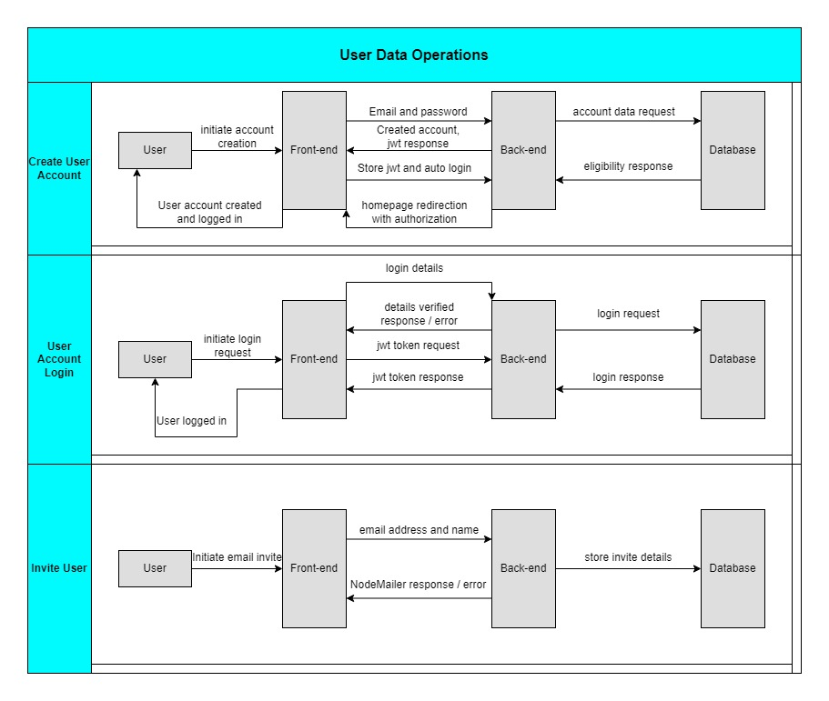
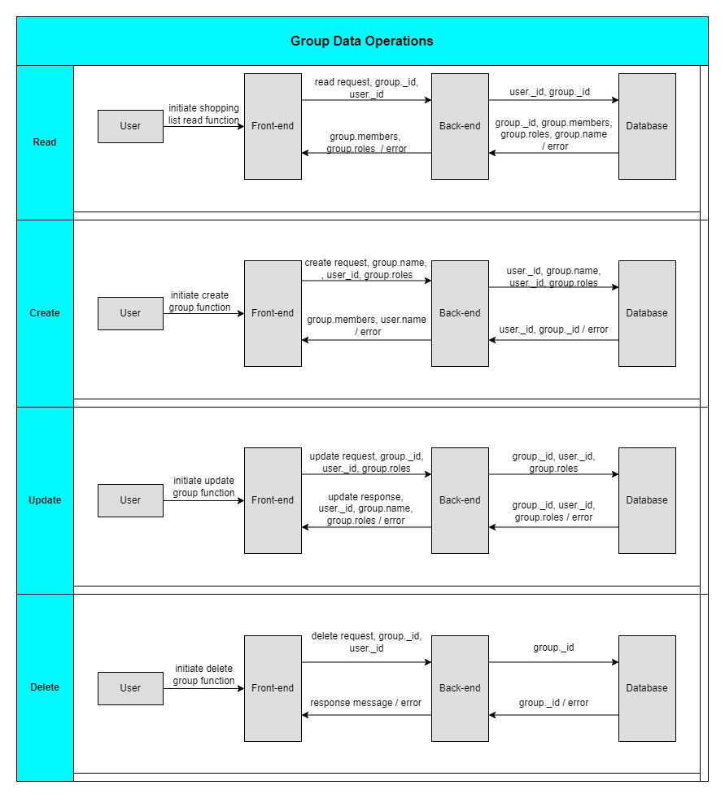
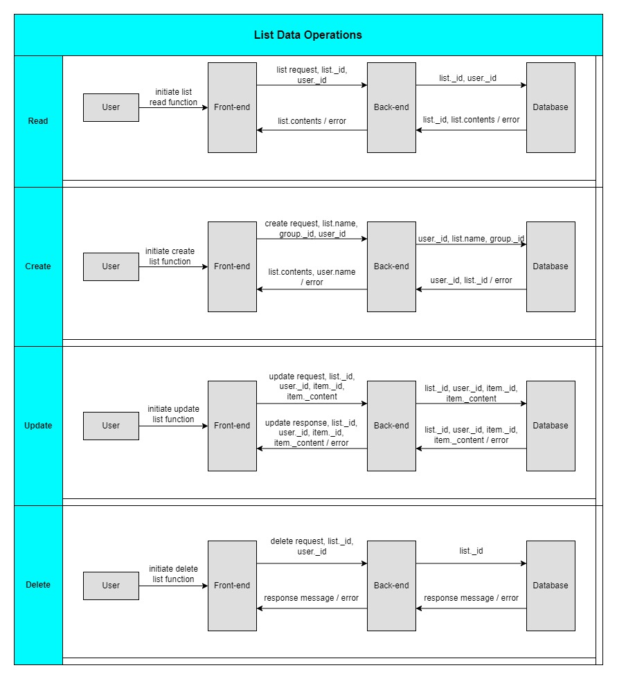
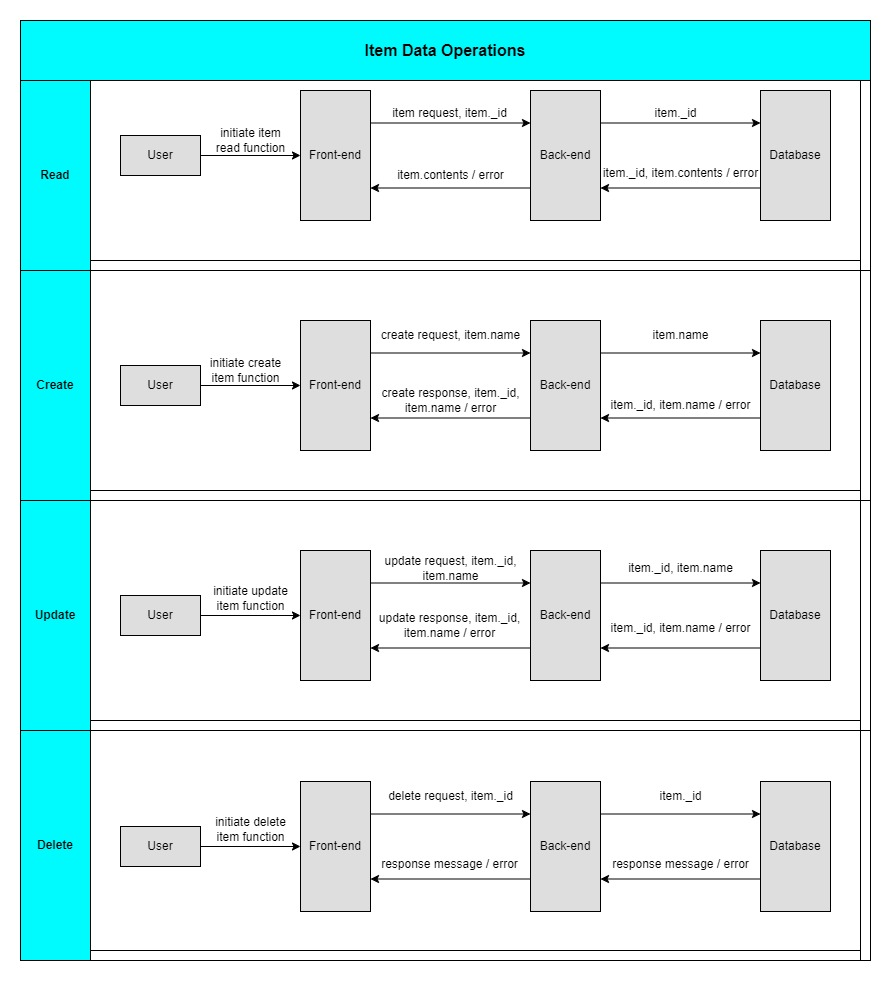
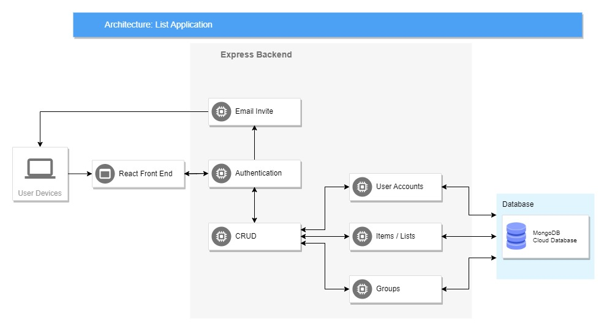

# **R1**
## Description of your website, including: Purpose, Functionality / features, Target audience, Tech stack

### Purpose:
The purpose of the app is to provide users with an effective and easy-to-use solution for sharing and collaborating on lists. Lists are used for many varying applications such as a grocery list, a to-do list, a travel itinerary a to-do list and more. This app aims to streamline the process of creating, sharing, and managing lists among multiple users with ease. It aims to have a clean UI and UX that makes sense without a steep learning curve so the user can efficiently use the list right away.

### Functionality / Features:

The app aims to have the following features. Although during development, things may change:

- User signup using bcrypt for passwords.

- User sign in page with password reset option.

- Once a user successfully signs up for an account they can create shared groups and add people to them via email. Groups are an optional feature which is useful for users who frequently share lists with the same people. A user can also invite people directly via email without the need to create a group.

- Users can create, read, update and delete new lists.

- Once a list is no longer needed it can be marked as completed.
There will be a "completed" section of the app where completed lists can be read, marked as active, or be deleted.

- All people with access to a list can add items and cross them off the list with a checkbox.

- Crossing items off the list adds a line through the text and ticks the checkbox for easy visual confirmation.

- User accounts, user groups, lists and list items are stored in individual MongoDB collections.

- Multiple users can collaborate on the same list simultaneously, adding items, crossing out completed tasks, and making real-time updates. This feature promotes teamwork and ensures everyone stays on the same page, literally.

### Target Audience:
The app's target audience is any individual or group of people who frequently need to create and manage shared lists. It caters to users of all ages and technical backgrounds, aiming to provide a user-friendly experience for both tech-savvy individuals and those less familiar with technology.

### Tech Stack:
The app utilizes a modern tech stack to deliver a seamless and responsive user experience:

Front-end: HTML, CSS, JavaScript, React.js
 
Back-end: Node.js, Express.js
 
Database: MongoDB
 
Hosting: Netlify
 
Authentication: JWT (JSON Web Tokens)

# **R2**	
## Dataflow Diagrams

# **R3**	
## Application Architecture Diagram

# **R4**	
## User Stories

1. As an active business person, I want to be able to quickly create lists when I'm on the go and share them with my colleagues so we can keep track of deadlines and prioritize tasks while collaborating efficiently.

2. As a student, I want to be able to share lists with my cohorts so that we can  work together on upcoming group assignments and check off the list as they are completed in order to stay up-to-date on what tasks are ahead of us.

3. As a parent, I want to be able to create weekly grocery lists that can be easily edited while at the supermarket because my grocery needs a frequently changing. I want to share this list with my partner so they can add items to the list that I may have  forgotten.

4. As a travelling salesperson I want to be able to create a list of clients and be able to mark them as completed or crossed out so that I can keep track of the clients who I have visited on any given day.

5. As a person who is not highly tech savvy, I would like to be able to have create to-do lists in an app that is simple to use so that I can focus on my tasks without getting overwhelmed by complex user interfaces.

6. As a camping enthusiast, I want to make an inventory of all of my camping gear so that I can check that I have everything I need before heading off to my next camping adventure. After my camping trip has finished, I want to be able to quickly unmark all items on the list so that I can go through the list again for future trips. I want to be able to easily edit and delete items when I buy or replace things.

# **R5**	
## Wireframes for multiple standard screen sizes, created using industry standard software

The below working file contains wireframes/designs for mobile, tablet and desktop. In the mobile design, the relationship between each page is outlined. The relationships displayed in the mobile version and the same for the tablet and desktop versions.

Please click the below link to view the Figma file:

https://www.figma.com/file/Ef1YxeoB6ynW9VCMY6zRdx/T3A2?type=design&node-id=0%3A1&mode=design&t=bNSu0Xi3jqdfKIgB-1

# **R6**	
## Screenshots of your Trello board throughout the duration of the project

Please click the below link to view the Trello Board:

https://trello.com/b/8YmuMz1R/t3a2-part-a